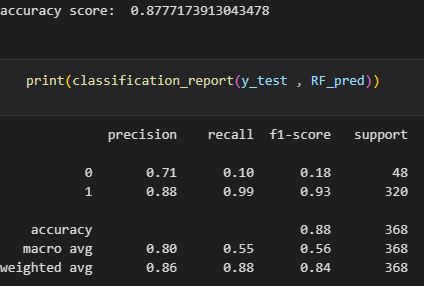

# 📊 Employee Attrition Prediction  

  
  
  

**Predicting employee turnover using data analysis and machine learning to help organizations reduce attrition.**  

---

## 🔍 Overview  
This project analyzes employee attrition by leveraging **Exploratory Data Analysis (EDA)** and **machine learning models**. The goal is to identify key factors driving employee turnover and build a predictive model to help HR teams take proactive retention measures.  

---

## 🚀 Key Features  
✔ **Exploratory Data Analysis (EDA)**  
- Visualized trends and correlations  
- Identified class imbalance in `Attrition`  
- Analyzed feature distributions
- 
- 

✔ **Data Preprocessing**  
- Encoded categorical variables (`BusinessTravel`, `Department`)  
- Handled missing values  
- Feature selection  

✔ **Machine Learning Models**  
| Model            | Accuracy 
|------------------|----------
| Random Forest    | 87%      

✔ **Model Evaluation**  
- Generated classification reports  
- Confusion matrix analysis
- 

---

